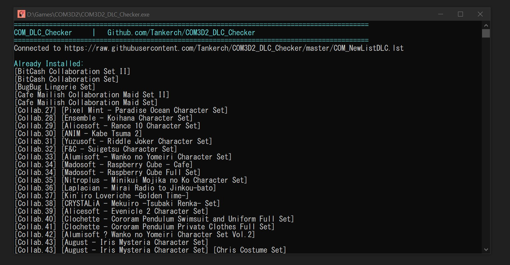

# COM3D2 DLC Checker

Apps that checking which one DLC have been installed and not. Always up-to-date if you have an internet connection and I'm still managing the repo.

## How to Use

1.  Download the latest release
2.  (Optional, but recommended) Move "COM3D2_DLC_Cheker.exe" to the game directory (where CM3D2.exe/COM3D2.exe is located)
3.  Run "COM3D2_DLC_Cheker.exe"

## 如何使用

1.  release 里下载最新版本
2.  运行 COM3D2_DLC_Checker.exe

## New Version! v.3.1.0

1. [ADD] Game selection. CM3D2 now supported
2. [FIX] Supported for COM3D2.5
3. [FIX] Using test directory for find game directory

## FAQ

**Q: Is this repo still maintained?**

A: Only the apps itself, Any error or unexpected case? I will fix it, when I have a spare time.
But, I cannot guaranteed DLC list is updated. Let say is more hard to "verify" DLC data.
